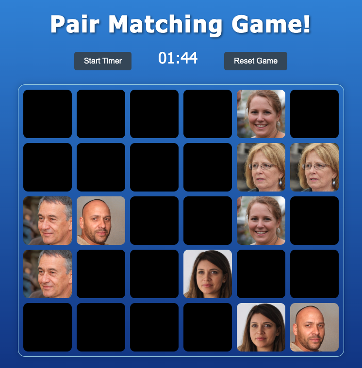

# Pair Matching Game



## Why the Project is Useful

This project is a simple yet engaging pair matching game that helps users improve their memory and concentration skills. The game is visually appealing, with a beautiful gradient background and a contrasting game board, making it enjoyable to play. Faces are generated by IA so are people who do not exist. It's a great way to pass time while also giving your brain a workout.

## How Users Can Get Started with the Project

To get started with the Pair Matching Game, follow these steps:

1. **Clone the Repository:**
   ```sh
   git clone https://github.com/yourusername/pair-matching-game.git

2. **Navigate to the Project Directory:**
   ```sh
   cd pair-matching-game

3. **Install Dependencies:**
   Make sure you have Node.js installed. Then, install the necessary dependencies:
   ```sh
   npm install

4. **Run the Project:**
   Start the development server using Vite:
   ```sh
   npm run dev

5. **Open in Browser:**
   Open your browser and go to http://localhost:3000 to play the game.

## Where Users Can Get Help with Your Project

If you need any help with the Pair Matching Game, you can reach out through the following channels:

- **Issues:** You can report issues or ask questions by creating an issue on the [GitHub repository](https://github.com/QuinteroDev/pairsGame/issues).
- **Email:** For direct inquiries, you can contact me at [info@quintero.cz](mailto:info@quintero.cz).

